# Style gallery

Sample diagrams that exercise the renderer's style-config props (per-node
`style`, per-edge `style`, `fromHandle`/`toHandle`, routing modes,
diagram-level defaults via `RenderSvgOptions`).

Each entry has a self-contained `.json` (the diagram), a `.svg`, and a
`.png` rendered through `@aigentive/wire-core`'s `renderToSvg` plus
`@resvg/resvg-js`. Regenerate with:

```bash
npm run build:core
node scripts/render-style-gallery.mjs
```

## Themes

| Sample | Look | What it shows |
|---|---|---|
| `theme-dark` | 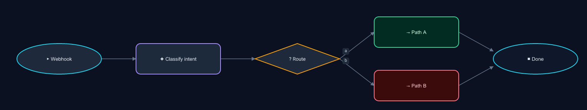 | Dark canvas + per-kind accent strokes. Uses `RenderSvgOptions.background` and per-node `style.fill` / `stroke` / `textColor`. |
| `theme-blueprint` | 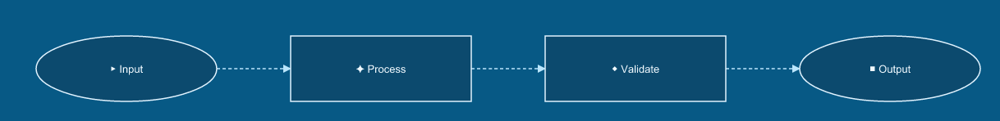 | Engineering schematic — squared corners (`borderRadius: 0`), white-on-blue, dashed edges. |
| `theme-pastel` | 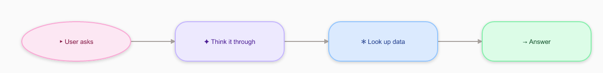 | Soft cards with `borderRadius: 24` and `shadow: true`; per-kind pastel fills. |
| `theme-mono` | 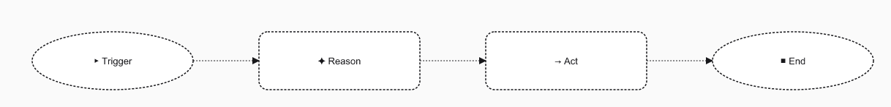 | Stroke-only, dashed borders on every node and edge — diagram-level `edgeStyle.strokeDasharray`. |
| `theme-neon` | 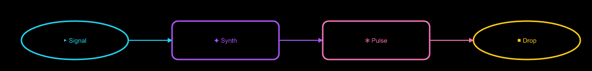 | Black canvas, neon strokes. Each edge sets its own color via `edge.style.stroke`. |

## Feature showcases

| Sample | Look | What it shows |
|---|---|---|
| `feature-routing-modes` | 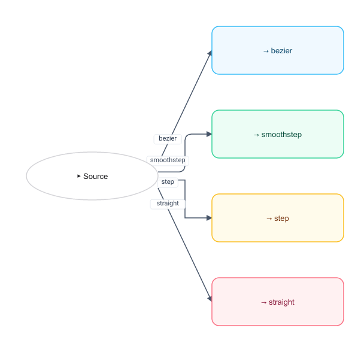 | All four `routing` values — `bezier`, `smoothstep`, `step`, `straight` — from one source to four targets. |
| `feature-edge-markers` | 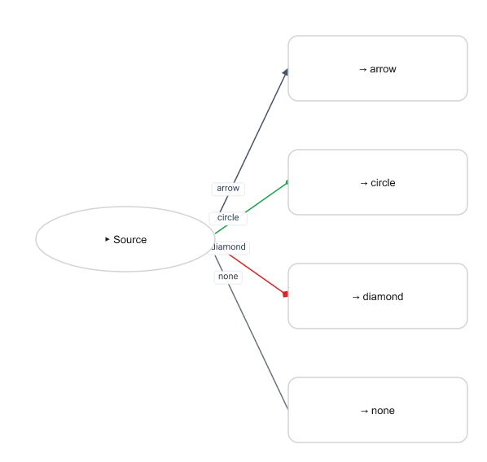 | `markerEnd: "arrow" \| "circle" \| "diamond" \| "none"`. Marker `<defs>` are deduplicated by shape + color. |
| `feature-edge-styles` | 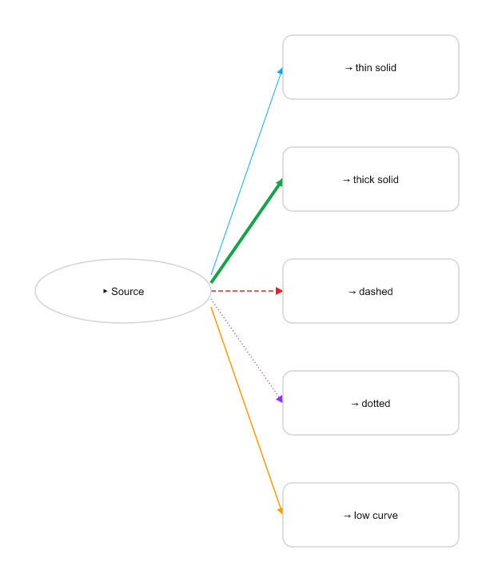 | Stroke color / width / dasharray / curvature combinations. |
| `feature-handles` | 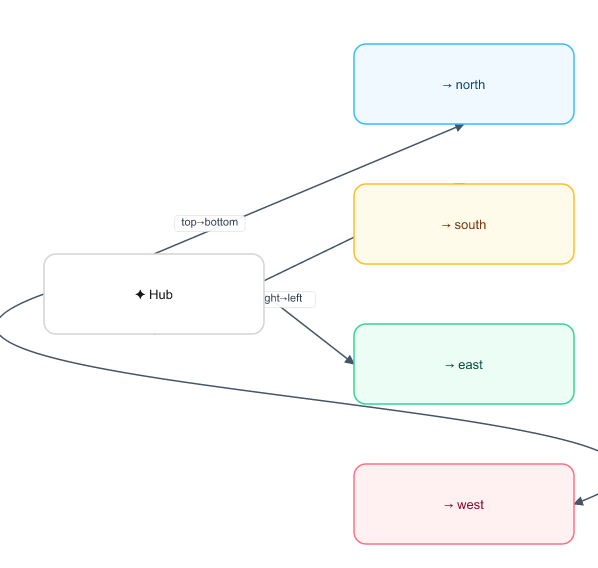 | `fromHandle` + `toHandle` pin specific edges to specific node sides (top/bottom/left/right). |
| `feature-node-styles` | 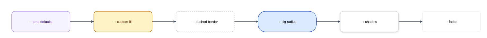 | Per-node `style` props side by side — tone defaults, custom fill, dashed border, big radius, drop shadow, faded opacity. |
| `feature-fanin-slots` | 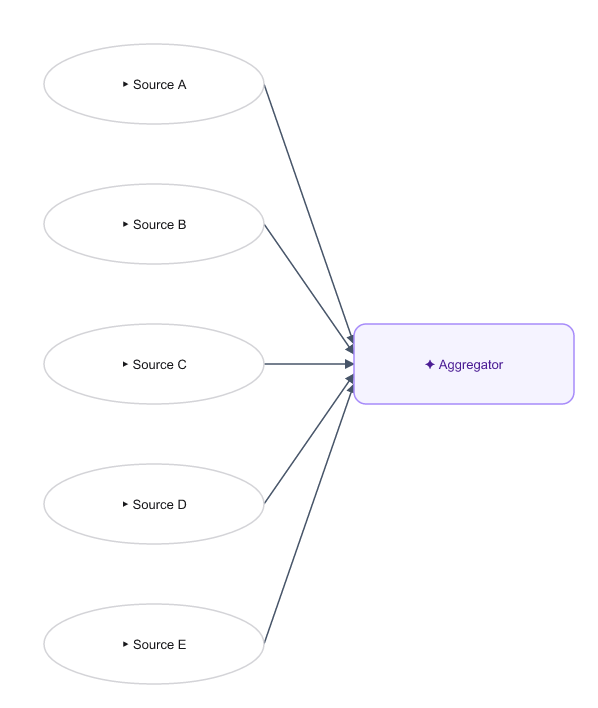 | Five incoming edges to one side auto-distribute between 25% and 75% of the side length (no manual offset config needed). |

## Vertical (TB) variants

Same showcases laid out top-to-bottom — useful when the diagram needs to
fit a portrait/narrow surface or live inside vertically-scrolling docs.
The default handle pair for `layout: "TB"` is `bottom → top`, so flow
runs downward.

| Sample | Look |
|---|---|
| `theme-dark-tb` | 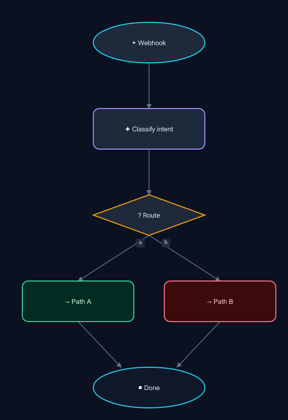 |
| `theme-blueprint-tb` | 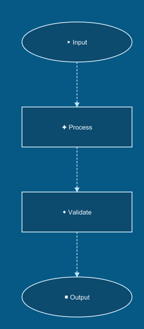 |
| `theme-pastel-tb` | 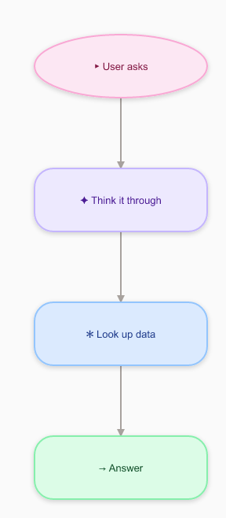 |
| `theme-mono-tb` | 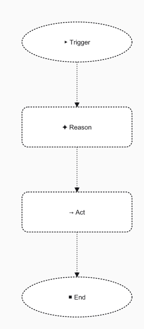 |
| `theme-neon-tb` | 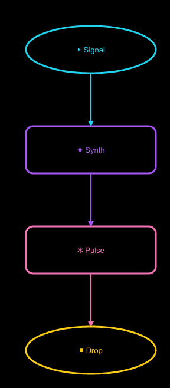 |
| `feature-routing-modes-tb` | 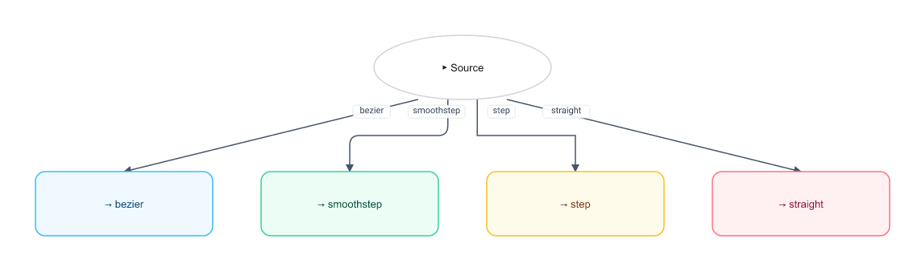 |
| `feature-edge-markers-tb` | 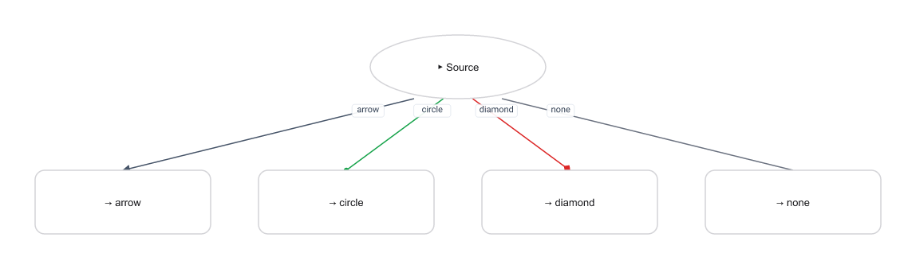 |
| `feature-edge-styles-tb` | 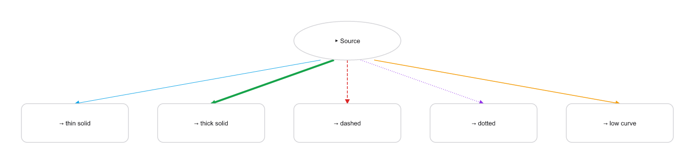 |
| `feature-handles-tb` | 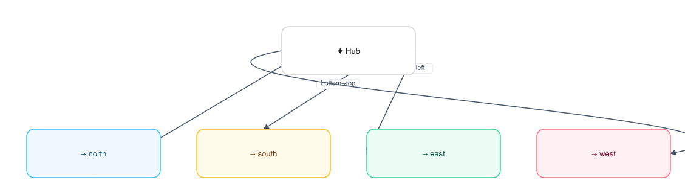 |
| `feature-node-styles-tb` | 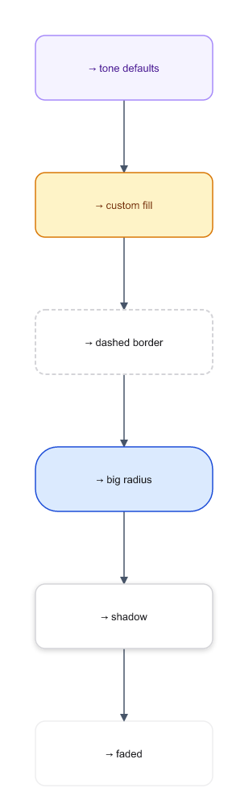 |
| `feature-fanin-slots-tb` | 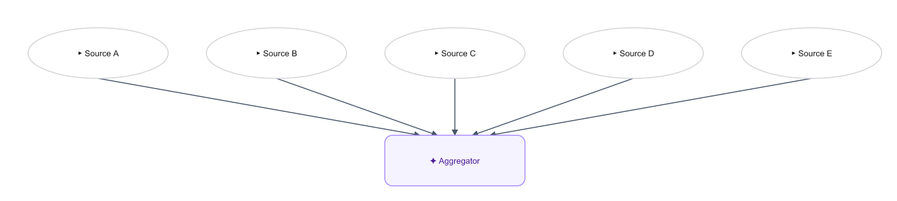 |

## Reusing a theme

The themes that use diagram-level defaults (`theme-dark`, `theme-mono`,
`theme-pastel`, `theme-blueprint`, `theme-neon`) need their
`RenderSvgOptions` passed at render time:

```ts
import { renderToSvg } from "@aigentive/wire-core";

const svg = renderToSvg(diagram, {
  background: "#0b1120",
  edgeStyle: { stroke: "#64748b", strokeWidth: 1.5 },
  edgeLabelStyle: { fill: "#cbd5e1", background: "#1e293b", border: "#334155" }
});
```

Per-node and per-edge `style` props live inside the diagram JSON itself,
so any consumer (CLI, MCP server, playground) renders them without extra
configuration.
